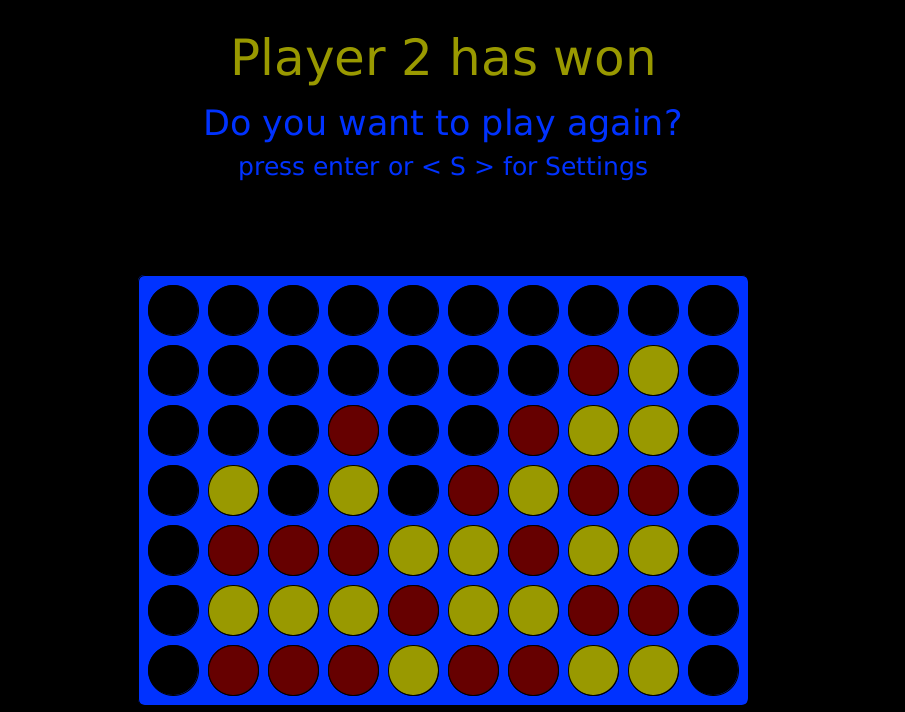

# Connect Four 

## Description

Connect Four is a strategy game where Player take turn placing discs in a Board. The goal is to place multiple discs, generally four, to form a vertical, horizontal, or diagonal line with discs of your color. The discs drop straight down and can be stacked on top of each other. 

The board can be resized with the only limit that it can't be smaller than the length to win. The game has no CPU and has to be played with two players
(83 Words)

## Screenshot

## Usage

You place discs in the rows with your mouse. You only have to hit the row, because the column is determined automaticly. 

Before a game you can press `S` to de- and increase the board width with your left and right arrowkeys. With the top and bottom arrow keys you can in- and decrease the board height. 

You restart a game by pressing `enter`.

## File Overview and Lines of Code

    \build.gradle
	\core.jar
	\Screenshot.png    
	\README.md    
	\src\main\java\ConnectFourBackend\Board.java
	\src\main\java\ConnectFourBackend\ConnectFour.java
	\src\main\java\ConnectFourBackend\ConnectFourInterface.java
	\src\main\java\ConnectFourBackend\Player.java
	\src\main\java\ConnectFourGUI\App.java
	\src\main\java\ConnectFourGUI\Board.java
	\src\main\java\ConnectFourGUI\Disc.java
	\src\main\java\ConnectFourGUI\Setup.java   
	\src\test\java\ConnectFourBackend\ConnectFourTest.java

	-------------------------------------------------------------------------------
	Language                     files          blank        comment           code
	-------------------------------------------------------------------------------
	Java                             9             94            174            478
	Markdown                         1             18              0             73
	Gradle                           1              8             14             19
	-------------------------------------------------------------------------------
	SUM:                            11            120            188            570
	-------------------------------------------------------------------------------

## Sources Directory

* [https://processing.org/reference/](https://processing.org/reference/) (2021-07-04)
* [https://en.wikipedia.org/wiki/Connect_Four](https://en.wikipedia.org/wiki/Connect_Four) (2021-07-04)
* [https://junit.org/junit5/docs/current/user-guide/](https://junit.org/junit5/docs/current/user-guide/) (2021-06-24)

